# Programmablaufplan: Stadt-Land-Fluss

## Grafischer Ablaufplan (Mermaid)

```mermaid
flowchart TD
    Start([START<br/>main.py]) --> LoadHS[Highscore laden<br/>json_load]
    LoadHS --> |Error?| LoadErr{Fehler?}
    LoadErr --> |Ja| EmptyHS[Leere Liste erstellen]
    LoadErr --> |Nein| Greeting
    EmptyHS --> Greeting
    
    Greeting[Begrüßung anzeigen<br/>greeting] --> AppLoop{{"ÄUSSERER APP LOOP<br/>━━━━━━━━━━━━━━━"}}
    
    AppLoop --> ShowMenu[Menü anzeigen<br/>1-Play 2-HS 3-Help 4-Exit]
    ShowMenu --> GetChoice[User-Input:<br/>Menüauswahl]
    GetChoice --> |Invalid| InvalidChoice[Fehler:<br/>Ungültige Eingabe]
    InvalidChoice --> AppLoop
    
    GetChoice --> Choice{Auswahl?}
    
    Choice --> |1 - Play| GameStart[["🎮 INNERER GAME LOOP<br/>════════════════"]]
    Choice --> |2 - Highscore| ShowHS[Highscore anzeigen<br/>show_highscore]
    Choice --> |3 - Help| ShowRules[Regeln anzeigen<br/>show_rules]
    Choice --> |4 - Exit| ExitGame[Verabschiedung<br/>exit_game]
    
    ShowHS --> AppLoop
    ShowRules --> AppLoop
    
    %% INNERER GAME LOOP BEGINNT
    GameStart --> GenChar[Zufallsbuchstabe<br/>A-Z generieren]
    GenChar --> DisplayChar[Buchstabe anzeigen]
    DisplayChar --> StartTimer[⏱️ Timer starten<br/>time.time]
    
    StartTimer --> InputStadt[Input: Stadt]
    InputStadt --> |Ctrl+C/EOF| AbortGame[Spiel abgebrochen<br/>return None]
    InputStadt --> InputLand[Input: Land]
    InputLand --> |Ctrl+C/EOF| AbortGame
    InputLand --> InputFluss[Input: Fluss]
    InputFluss --> |Ctrl+C/EOF| AbortGame
    
    InputFluss --> StopTimer[⏱️ Timer stoppen<br/>Zeitdifferenz]
    StopTimer --> ShowTime[Zeit anzeigen]
    
    ShowTime --> ValidStadt{Wikipedia-Check:<br/>Stadt gültig?}
    ValidStadt --> |Ja| Points5A[+5 Punkte]
    ValidStadt --> |Nein/Fehler| Points0A[+0 Punkte]
    ValidStadt --> |Netzwerkfehler| NetErr1[Fehlermeldung<br/>+0 Punkte]
    
    Points5A --> ValidLand{Wikipedia-Check:<br/>Land gültig?}
    Points0A --> ValidLand
    NetErr1 --> ValidLand
    
    ValidLand --> |Ja| Points5B[+5 Punkte]
    ValidLand --> |Nein/Fehler| Points0B[+0 Punkte]
    ValidLand --> |Netzwerkfehler| NetErr2[Fehlermeldung<br/>+0 Punkte]
    
    Points5B --> ValidFluss{Wikipedia-Check:<br/>Fluss gültig?}
    Points0B --> ValidFluss
    NetErr2 --> ValidFluss
    
    ValidFluss --> |Ja| Points5C[+5 Punkte]
    ValidFluss --> |Nein/Fehler| Points0C[+0 Punkte]
    ValidFluss --> |Netzwerkfehler| NetErr3[Fehlermeldung<br/>+0 Punkte]
    
    Points5C --> CalcBonus[Bonusberechnung:<br/>Zeit < 30s?]
    Points0C --> CalcBonus
    NetErr3 --> CalcBonus
    
    CalcBonus --> |Ja| AddBonus[Punkte * Bonusfaktor]
    CalcBonus --> |Nein| NoBonus[Punkte unverändert]
    CalcBonus --> |Fehler| BonusErr[Warnung<br/>Punkte ohne Bonus]
    
    AddBonus --> InputName[Input: Name]
    NoBonus --> InputName
    BonusErr --> InputName
    
    InputName --> |Leer| NameEmpty[Fehler: Name leer<br/>Erneut fragen]
    InputName --> |Zu lang| NameLong[Fehler: Zu lang<br/>Erneut fragen]
    InputName --> |Gültig| ValidName[Name gespeichert]
    InputName --> |Ctrl+C/EOF| DefaultName[Standardname:<br/>'Unbekannt']
    
    NameEmpty --> InputName
    NameLong --> InputName
    
    ValidName --> ShowPoints[Punktzahl anzeigen]
    DefaultName --> ShowPoints
    
    ShowPoints --> UpdateHS[Highscore aktualisieren]
    UpdateHS --> SaveHS{Speichern<br/>erfolgreich?}
    
    SaveHS --> |Ja| SaveOK[✓ Erfolgreich gespeichert]
    SaveHS --> |Nein| SaveErr[⚠️ Fehler beim Speichern<br/>Warnung anzeigen]
    
    SaveOK --> GameEnd[["🏁 GAME LOOP ENDE<br/>════════════════"]]
    SaveErr --> GameEnd
    AbortGame --> GameEnd
    
    GameEnd --> AppLoop
    
    %% APP LOOP ENDE
    ExitGame --> SaveFinalHS[Final: Highscore speichern]
    SaveFinalHS --> End([ENDE])
    
    %% Styling
    classDef errorStyle fill:#ff6b6b,stroke:#c92a2a,stroke-width:2px,color:#fff
    classDef successStyle fill:#51cf66,stroke:#2f9e44,stroke-width:2px,color:#fff
    classDef warningStyle fill:#ffd43b,stroke:#fab005,stroke-width:2px,color:#000
    classDef loopStyle fill:#748ffc,stroke:#4c6ef5,stroke-width:3px,color:#fff,font-weight:bold
    classDef inputStyle fill:#69db7c,stroke:#37b24d,stroke-width:2px
    classDef checkStyle fill:#ffa94d,stroke:#fd7e14,stroke-width:2px
    
    class NetErr1,NetErr2,NetErr3,SaveErr,AbortGame,InvalidChoice,NameEmpty,NameLong errorStyle
    class SaveOK,Points5A,Points5B,Points5C,AddBonus,ValidName successStyle
    class BonusErr,NoBonus,Points0A,Points0B,Points0C warningStyle
    class AppLoop,GameStart,GameEnd loopStyle
    class InputStadt,InputLand,InputFluss,InputName,GetChoice inputStyle
    class ValidStadt,ValidLand,ValidFluss,Choice,SaveHS checkStyle
```



## Legende

### Farben:
- 🔵 **Blau** = Loop-Marker (Äußerer/Innerer Loop)
- 🟢 **Grün** = Erfolgreiche Operationen / Input-Felder
- 🟡 **Gelb** = Warnungen / Keine Punkte
- 🔴 **Rot** = Fehler / Abbrüche
- 🟠 **Orange** = Entscheidungspunkte

### Symbole:
- `([...])` = Start/Ende
- `[...]` = Prozess/Aktion
- `{...}` = Entscheidung (if/else)
- `[[...]]` = Loop-Marker

---

## Detaillierte Beschreibung der Loops

### 1. ÄUSSERER APP LOOP (Hauptschleife)

**Zweck:** Hält die Anwendung am Laufen und ermöglicht mehrere Spiele

**Ablauf:**
```
┌─────────────────────────────────────┐
│   START → Highscore laden           │
│           ↓                         │
│   ┌─────────────────────────┐      │
│   │  MENÜ-SCHLEIFE (while)  │ ←────┤
│   │  1. Menü anzeigen       │      │
│   │  2. User-Auswahl        │      │
│   │  3. Aktion ausführen    │      │
│   └─────────────────────────┘      │
│           ↓                         │
│   Bei Exit: Ende                    │
│   Sonst: Zurück zum Menü ──────────┘
└─────────────────────────────────────┘
```

**Code-Referenz:**
- Datei: `main.py` → `main()` Funktion
- Loop: `while True:` Zeile 20
- Exit-Bedingung: `if not menu()` → `break`

---

### 2. INNERER GAME LOOP (Spielrunde)

**Zweck:** Führt eine komplette Spielrunde durch

**Ablauf:**
```
┌─────────────────────────────────────────┐
│   GAME START                            │
│   ↓                                     │
│   1. Buchstabe generieren (A-Z)         │
│   2. Timer starten                      │
│   3. Eingaben sammeln (Stadt/Land/Fluss)│
│   4. Timer stoppen                      │
│   5. Validierung (Wikipedia-Check) ───┐ │
│      ├─ Stadt (5 Punkte?)             │ │
│      ├─ Land (5 Punkte?)              │ │
│      └─ Fluss (5 Punkte?)             │ │
│   6. Bonus berechnen (Zeit < 30s?)    │ │
│   7. Name abfragen                    │ │
│   8. Highscore aktualisieren          │ │
│   9. Speichern                        │ │
│   ↓                                   │ │
│   GAME ENDE → Zurück zum Menü        │ │
└───────────────────────────────────────┘ │
                                          │
    Error-Handling überall aktiv: ────────┘
    - Netzwerkfehler
    - User-Abbruch (Ctrl+C)
    - Ungültige Eingaben
```

**Code-Referenz:**
- Datei: `backend.py` → `play()` Funktion
- Keine explizite Loop (einmalige Ausführung pro Aufruf)
- Rückkehr zum App-Loop nach Abschluss

---

## Wichtige Verzweigungspunkte

### A. Menü-Auswahl (Choice)
```
User Input → [1] Play    → Innerer Game Loop
          → [2] Highscore → Anzeige + zurück
          → [3] Help      → Regeln + zurück
          → [4] Exit      → Programm-Ende
```

### B. Wikipedia-Validation (pro Kategorie)
```
check_answer() → [Valid] +5 Punkte
               → [Invalid] +0 Punkte
               → [Network Error] +0 Punkte + Fehlermeldung
```

### C. Error-Handling-Punkte
```
1. Highscore laden     → FileNotFoundError → Leere Liste
2. User-Input          → KeyboardInterrupt → Abbruch
3. Wikipedia-Check     → ConnectionError → 0 Punkte
4. Namenseingabe       → Leer/Zu lang → Erneut fragen
5. Highscore speichern → PermissionError → Warnung
```

---

## Datenfluss

```
┌──────────────┐
│   Start      │
└──────┬───────┘
       │
       ↓
┌──────────────────────────────┐
│  Highscore (JSON-Datei)      │
│  ┌────────────────────────┐  │
│  │ [{Name, Punkte, Zeit}] │  │
│  └────────────────────────┘  │
└──────┬───────────────────────┘
       │ Laden
       ↓
┌──────────────────────────────┐
│  Hauptmenü (App Loop)        │
│  ┌─────────────┐             │
│  │ Menu-State  │             │
│  └─────────────┘             │
└──────┬───────────────────────┘
       │ Play ausgewählt
       ↓
┌──────────────────────────────┐
│  Spielrunde (Game Loop)      │
│  ┌─────────────────────────┐ │
│  │ result = {             │ │
│  │   Name: str           │ │
│  │   Punkte: float       │ │
│  │   Zeit: float         │ │
│  │   ABC: char           │ │
│  │ }                     │ │
│  └─────────────────────────┘ │
└──────┬───────────────────────┘
       │ Ergebnis
       ↓
┌──────────────────────────────┐
│  Highscore Update            │
│  Append result zu Liste      │
└──────┬───────────────────────┘
       │ Speichern
       ↓
┌──────────────────────────────┐
│  Highscore (JSON-Datei)      │
│  Aktualisiert                │
└──────────────────────────────┘
```

---

## Thread-Sicherheit

**Hinweis:** Das aktuelle Programm ist **single-threaded** und benötigt keine Thread-Synchronisation.

Falls zukünftig mehrere Spieler gleichzeitig spielen:
- ⚠️ JSON-Datei-Zugriff braucht Locking
- ⚠️ Highscore-Updates müssen atomar sein

---

## Performance-Charakteristiken

### Bottlenecks:
1. **Wikipedia-API-Calls** (3x pro Runde)
   - Latenz: ~100-500ms pro Call
   - Timeout: 10s
   - Gesamt: ~0.3-1.5s pro Runde

2. **User-Input** (Variable Zeit)
   - Unvorhersehbar
   - Keine technische Limitation

3. **JSON-File-I/O** (Minimal)
   - Laden: <1ms
   - Speichern: <5ms

### Optimierungspotential:
- Parallele Wikipedia-Calls (async/await)
- Caching häufiger Begriffe
- Local Wikipedia-Dump verwenden
